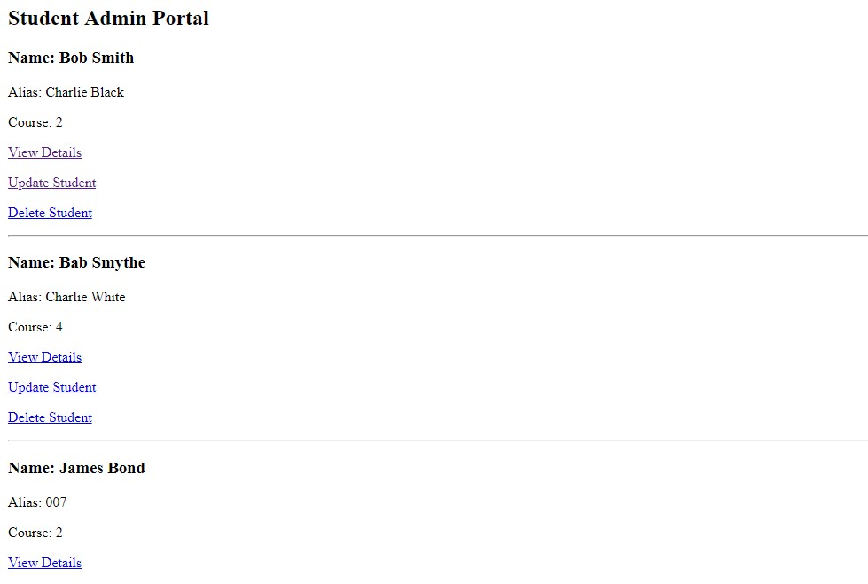

# Lab13-StudentEnrollment

## About this project
This project is an MVC application based on school enrollment. The user is granted access to an administrator portal for the school. They have the ability to perform CRUD operations on both students and schools. The information for the site is stored on a database, which is concurrently deployed along with the application on Azure.

## Example

## How to use
This program requires Visual Studio to view or edit the source files or database. The program does not require visual studio if the user simply wants to navigate to the site. The URL to the deployed site is:

http://spyschool.azurewebsites.net/

Once on the site, the user can click on the hyperlinks to perform their desired operation of viewing schools and students, as well as either updating either of those, creating new students or courses, or deleting courses. 

## Licensing
This program is used with a MIT license.

## Acknowldgments
My Life-Partner Steph Harper
jcqnly

